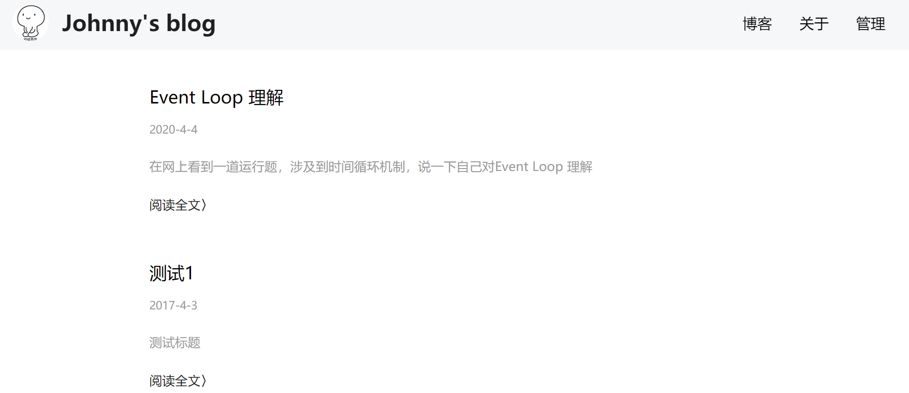
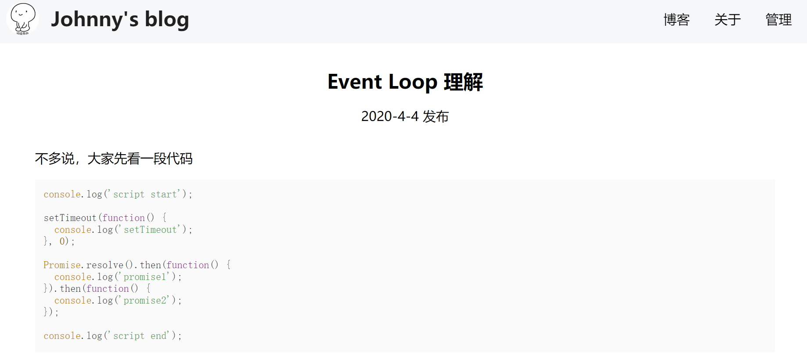
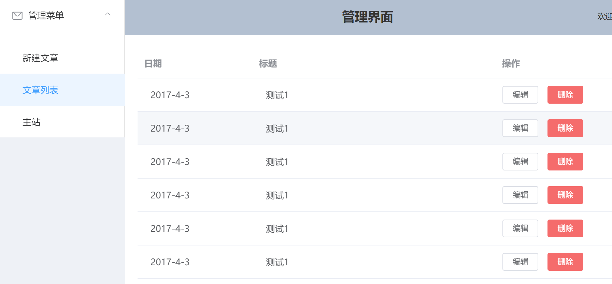
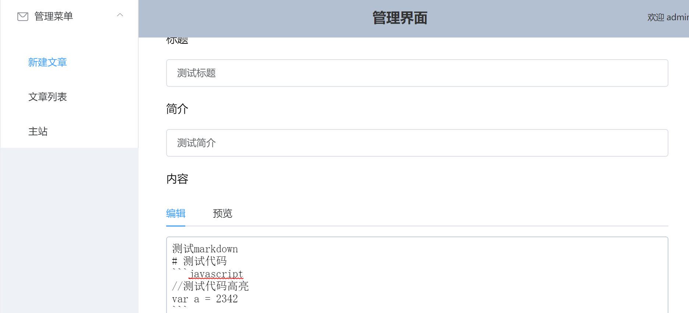
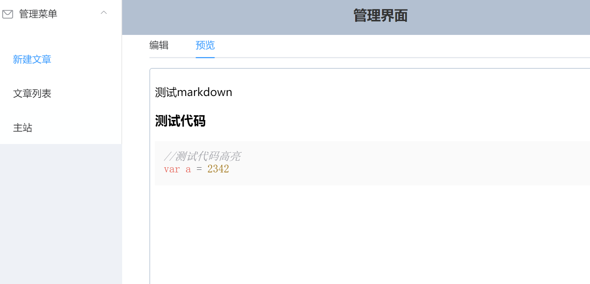

# vue-blog-master

vue+node+express+mongoose搭建的完整博客系统，前后端分离开发，简单清爽风格
## 实现的功能

+ 文章的发表，删除和更新
+ 支持markdown编辑
+ 支持markdown实时预览
+ 支持语法高亮
+ 用户登录验证系统
+ 使用token保存用户登录状态
+ 一个清爽冷淡的主题
## 技术栈

### 前端
+ vue
+ vue-router
+ element-ui
+ axios
+ marked
+ highlight.js
### 后端
+ express
+ jsonwebtoken
+ mongoose
### 工程管理
+ vue-cli
## 运行
### 环境
node >= 6.0.0
npm >= 3.0.0
### 运行
``` bash
# install dependencies
npm install

# run server
cd Server
node app

# serve with hot reload at localhost:8080
npm run dev

# build for production with minification
npm run build

# build for production and view the bundle analyzer report
npm run build --report
```
## 预览
#### 主页



#### 文章详情页


#### 后台管理页



#### 文章编辑页



#### md实时预览


